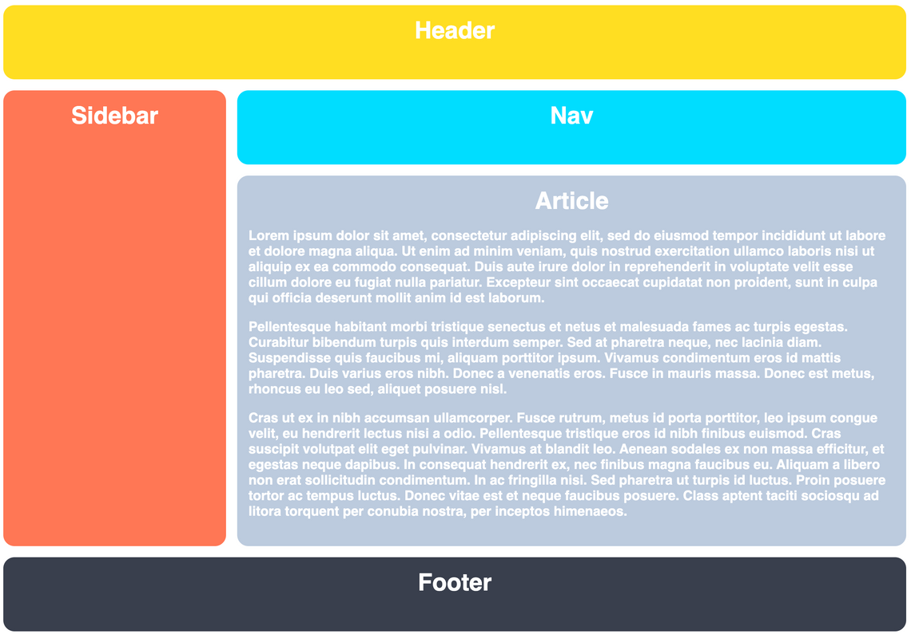

# css-practice

A tiny CSS playground to experiment with things.

---

Today, I'm practicing some CSS Grid.  I'll be building a layout from The Odin Project curriculum, working to reproduce the following template:

